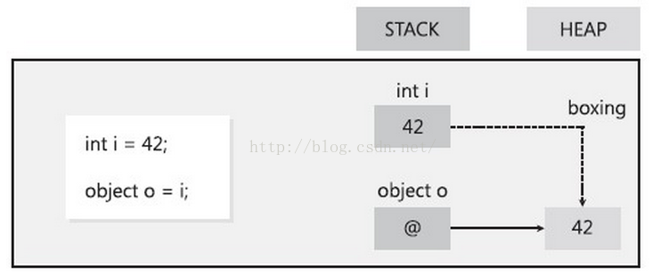
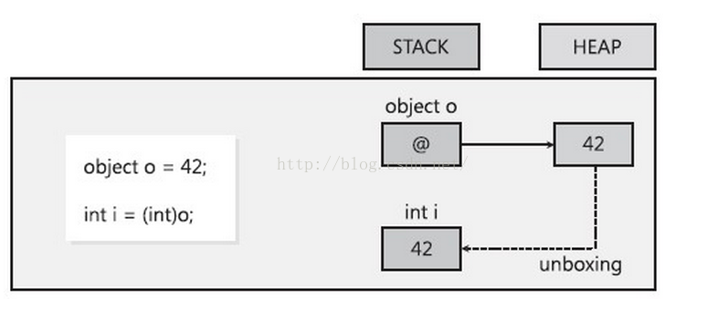

# 装箱 拆箱

**装箱是将值类型转换为引用类型 ；拆箱是将引用类型转换为值类型。**

C#中值类型和引用类型的最终基类都是Object类型（它本身是一个引用类型）。也就是说，值类型也可以当做引用类型来处理。而这种机制的底层处理就是通过装箱和拆箱的方式来进行，利用装箱和拆箱功能，可通过允许值类型的任何值与Object 类型的值相互转换，将值类型与引用类型链接起来 。


## 装箱
值类型转换为引用类型

```csharp
int val = 100
object obj = val
```



对值类型在堆中分配一个对象实例，并将该值复制到新的对象中。按三步进行。 
- 首先从托管堆中为新生成的引用对象分配内存(大小为值类型实例大小加上一个方法表指针和一个SyncBlockIndex)。 
- 然后将值类型的数据拷贝到刚刚分配的内存中。 
- 返回托管堆中新分配对象的地址。这个地址就是一个指向对象的引用了。
可以看出，进行一次装箱要进行分配内存和拷贝数据这两项比较影响性能的操作。


## 拆箱
引用类型转换为值类型
```csharp
int val = 100
object obj = val
int num = (int)obj
```


- 首先获取托管堆中属于值类型那部分字段的地址，这一步是严格意义上的拆箱。
- 将引用对象中的值拷贝到位于线程堆栈上的值类型实例中。
经过这2步，可以认为是同boxing是互反操作。严格意义上的拆箱，并不影响性能，但伴随这之后的拷贝数据的操作就会同boxing操作中一样影响性能。